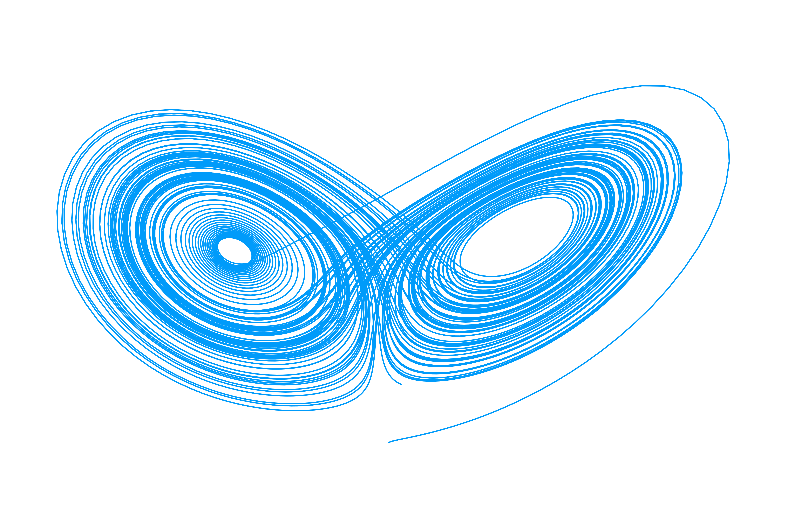

# StrangeAttractors.jl
A compilation of beautiful, strange chaotic attractors. 

## What does this package do? 

* Create plots of chaotic attractors
* Create high resolution images of these plots to use as wallpapers!

## How to use it

Start Julia by calling

```
julia
```

Navigate to the directory StrangeAttractors.jl and call

```
Pkg.activate(".")
```

Now we can start using StrangeAttractors.jl 

```
using StrangeAttractors

#Set our initial conditions for the Lorentz system
u0 = [1.0, 0.0, 0.0]

#Time range for our simulation
tspan = (0.0, 100.0)

#Set the parameters for our Lorentz system
p = [10.0, 28.0, 8/3]

#Call our wallpaper function
createwallpaper(parameterized_lorenz!, u0, tspan, p)
```

This should create a beautiful Lorentz attractor wallpaper!




## Please note this package is currently in early stage development, feel free to pitch in and contribute!
